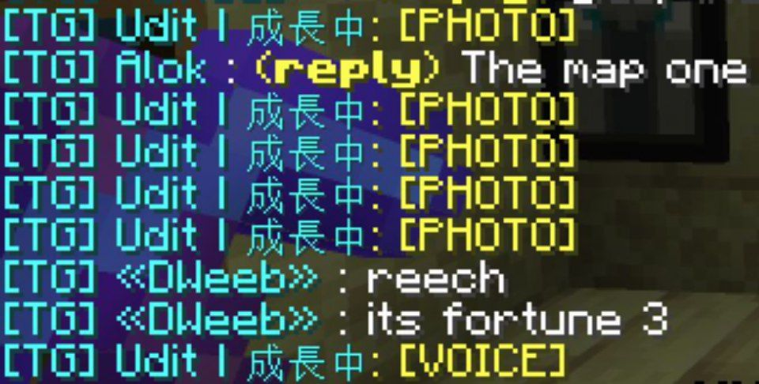
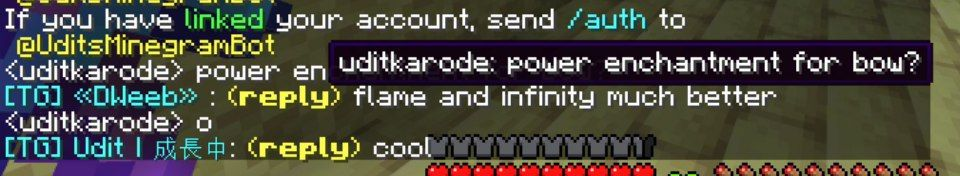
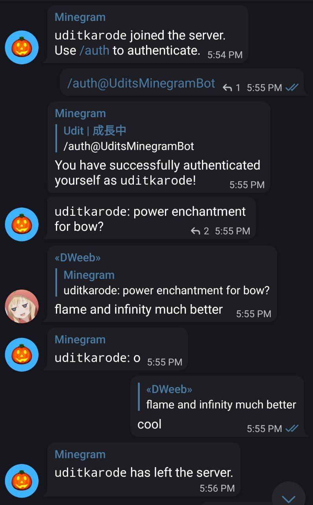
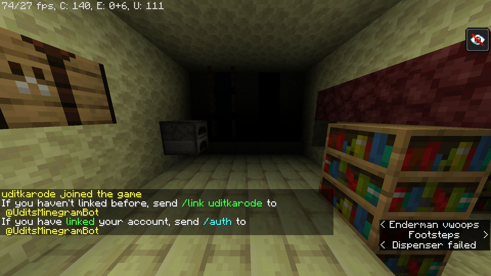

# Minegram
Minegram is a Minecraft-Telegram bridge. Read ahead for more examples and usage guide.
  

  
# What can it do?
1) Minegram can connect your Minecraft Java server with your Telegram chat. This means that whenever a player joins, leaves, makes an advancement, dies, or sends a chat message, a bot will notify the Telegram chat of it by sending a message. Messages sent on Telegram will also be displayed to players in Minecraft, allowing them to chat with people on Telegram through Minecraft or vice-versa.
    
2) Minegram has general user-experience improvements. It colors the logs that the server produces, making it more readable. It also sends a `stop` command to the server instead of a `SIGINT` (which happens when you use `systemctl stop` or `CTRL+C`), which ensures that everything is properly saved before exiting. Administrators can also execute commands using `/cli` command without having to log on to the server, for example `/cli time set night`.

3) Minegram can show the list of players online using `/list` on Telegram. It can also display the time in the Minecraft world by using `/time`.
  
4) Minegram comes with a toggleable Auth module. When the Auth module is enabled, players will have to link their Telegram accounts with their Minecraft IGN(In Game Name)s using the command `/link player_ign_here`. When a player joins the server, the gamemode for that player will automatically be switched to spectator mode, the player will be given blindness, and will be prevented from moving unless the linked Telegram account sends `/auth` on Telegram. This prevents people from logging on to offline-mode/cracked servers with other player's IGN(In Game Name)s and stealing their items/misbehaving with their identity.
  
# How to use
Grab the binary from https://github.com/uditkarode/Minegram/releases. Place it in the same folder as your Minecraft server JAR,  and also create a config file in the same directory with the filename `config` (NOTE: no extension!). Sample contents of the config file are given in the config file in this repository.
Then just execute the binary: `./Minegram` and you're set!
  
# Compiling from source
Compiling from source is very easy:  
  
```bash
go get -u gopkg.in/tucnak/telebot.v2
go get -u gorm.io/gorm
go get -u gorm.io/driver/sqlite
go get -u github.com/fatih/color
go build
```
# More Examples




IMPORTANT: make sure that bot privacy is turned **off** using BotFather so that non-command messages can be read by the bot!
